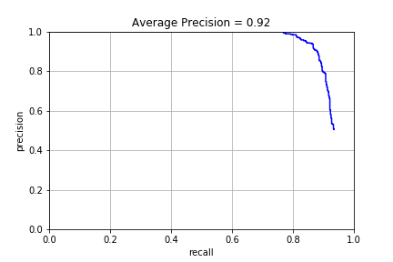

# Face-Detection-with-a-Sliding-Window

<center>

<br>
(Example face detection results from anXDdd.)
</center>

## Overview


The project is related to face detection, based on SVM(Support Vector Machine), a machine learning technique. The sliding window model is conceptually simple: independently classify all image patches as being object or non-object. Sliding window classification is the dominant paradigm in object detection and for one object category in particular -- faces -- it is one of the most noticeable successes of computer vision. In this project, instead of the original sliding window created in the late 20th centery and the beginning of 21th centery, I implemented the sliding window detector of Dalal and Triggs 2005, including handling heterogeneous training and testing data, training a linear classifier (a HoG template), and using your classifier to classify millions of sliding windows at multiple scales. Fortunately, linear classifiers are compact, fast to train, and fast to execute. A linear SVM can also be trained on large amounts of data, including mined hard negatives.

## Implementation
### 1. ```proj4.py```
The top level script for training and testing face detector. You can tune some important parameters here, such as ```lambda``` of SVM, ```step_size```, ```threshold``` and ```downsample``` of detector and ```template_size``` as well as ```hog_cell_size```. I will introduce the details of these parameters clearly later. The following parameters led to the highest accuracy, which was 92%.

```python
feature_params = {'template_size': 36,
'hog_cell_size': 3}

features_pos = get_positive_features(train_path_pos, feature_params)
num_negative_examples = 50000
features_neg, neg_examples = get_random_negative_features(non_face_scn_path, feature_params, num_negative_examples)

model = svm_classify(features_total, labels, C=0.1, max_iter=1000, tol=1e-4)

bboxes, confidences, image_ids = run_detector(
test_scn_path, model, feature_params, threshold=0.5, step_size=1, downsample=0.95)
```


### 2. ```get_positive_features.py```
This code will load cropped positive trained examples (faces) and convert them to HoG features with a call to cyvlfeat.hog. Here I implemented a simple data augmentation technique, mirror, thus the positive dataset was doubled, which was roughly 12000. Based on my experience, the larger the dataset, the better the performance. In addition, instead setting ```hog_cell_size``` as 6, I noticed smaller cell size was accompanied with higher accuracy.

```python
temp_size = feature_params['template_size']
cell_size = feature_params['hog_cell_size']

features_pos = []
for filename in glob.glob(train_path_pos + '/*.jpg'):
img = imread(filename)
img_mirror = img[:, ::-1]
hog_features = hog(img, cell_size=cell_size)
hog_features_mirror = hog(img_mirror, cell_size=cell_size)
hog_features = hog_features.flatten()
hog_features_mirror = hog_features_mirror.flatten()
features_pos.append(hog_features)
features_pos.append(hog_features_mirror)

features_pos = np.asarray(features_pos)
```

### 3.```get_random_negative_features.py```
In this section, we are going to sample random negative examples from scenes which contain no faces and convert them to HoG features. Due to the limitation of negative dataset, I implement data augmentation techniques as well, but much more complicated, such as vertical flip, horizontal flip, random crop and random affine. Here I used ```imgaug``` package to create 200 times larger dataset, which was 50000, comparing with original one. The highlighting code shows all parameters techniques I used.

```python
temp_size = feature_params['template_size']
cell_size = feature_params['hog_cell_size']

features_neg = []

i = 0
while i < num_samples:
for filename in glob.glob(non_face_scn_path + '/*.jpg'):
if i >= num_samples:
break
img = imread(filename)
img = color.rgb2gray(img)
#             img = resize(img, (temp_size, temp_size))

sometimes = lambda aug: iaa.Sometimes(0.5, aug)

# Define our sequence of augmentation steps that will be applied to every image
# All augmenters with per_channel=0.5 will sample one value _per image_
# in 50% of all cases. In all other cases they will sample new values
# _per channel_.
seq = iaa.Sequential(
[
# apply the following augmenters to most images
iaa.Fliplr(0.5), # horizontally flip 50% of all images
iaa.Flipud(0.5), # vertically flip 50% of all images
# crop images by -5% to 10% of their height/width
sometimes(iaa.CropAndPad(
percent=(-0.05, 0.1),
pad_mode=ia.ALL,
pad_cval=(0, 255)
)),
sometimes(iaa.Affine(
scale={"x": (0.8, 1.2), "y": (0.8, 1.2)}, # scale images to 80-120% of their size, individually per axis
translate_percent={"x": (-0.2, 0.2), "y": (-0.2, 0.2)}, # translate by -20 to +20 percent (per axis)
rotate=(-45, 45), # rotate by -45 to +45 degrees
shear=(-16, 16), # shear by -16 to +16 degrees
order=[0, 1], # use nearest neighbour or bilinear interpolation (fast)
cval=(0, 255), # if mode is constant, use a cval between 0 and 255
mode=ia.ALL # use any of scikit-image's warping modes (see 2nd image from the top for examples)
)),
],
random_order=True
)

seq_det = seq.to_deterministic()
img_aug = seq_det.augment_images([img])[0]

rand_x = np.random.randint(img_aug.shape[0]-temp_size)
rand_y = np.random.randint(img_aug.shape[1]-temp_size)
img_aug = img_aug[rand_x:rand_x+temp_size, rand_y:rand_y+temp_size]

hog_features = hog(img_aug, cell_size=cell_size)
hog_features = hog_features.flatten()
features_neg.append(hog_features)
i+=1

features_neg = np.asarray(features_neg)
neg_examples = num_samples
```

### 4.```svm_classify.py```
Here we will train a linear classifier from the positive and negative examples with a call to ```svm.LinearSVC()```. Parameter tuning plays an important role in this part, particularly ```lambda```. In this face detection module, it seems ```C=0.1``` or ```C=0.01``` is a good choice.

```python
clf = LinearSVC(C=C, class_weight=None, dual=True, fit_intercept=True,
intercept_scaling=1, loss='squared_hinge', max_iter= max_iter,
multi_class='ovr', penalty='l2', random_state=0, tol= tol,
verbose=0)
clf.fit(x, y)
```

### 5.```run_detector.py```
This is the most challenging part of face detection. As the result indicated, ```downsample```, ```cell_size``` and ```step_size``` influenced significantly. Instead of single fixed size bounding box, for each image, we will try with various size of bounding box, depending on the size of original image. Actually, the size of Hog cell never changes. Here we downsample the image, therefore, the Hog cell looks larger relative to the image. Last but not least, after creating several bounding boxes, we call ```non_max_supr_bbox.py``` to remove duplicate detections.

```python
test_images = os.listdir(test_scn_path)

# initialize these as empty and incrementally expand them.
bboxes = np.zeros([0, 4])
confidences = np.zeros([0, 1])
image_ids = np.zeros([0, 1])

cell_size = feature_params['hog_cell_size']
cell_num = feature_params['template_size'] / feature_params['hog_cell_size']  # cell number of each template

downsample = downsample
step_size = step_size
threshold = threshold

print("START: run_detector")

for i in range(len(test_images)):

scale = 1
cur_bboxes = np.zeros([0, 4])
cur_confidences = np.zeros([0, 1])
cur_image_ids = np.zeros([0, 1])
img = imread(os.path.join(test_scn_path, test_images[i]))
img = color.rgb2gray(img)
H = img.shape[0]
W = img.shape[1]
min_len = min(W, H)

while min_len*scale >= cell_size*cell_num:
img_re = resize(img, (int(H*scale), int(W*scale)))
hog_features = hog(img_re, cell_size=cell_size)

j = 0
while j <= hog_features.shape[0]-cell_num:
k = 0
while k <= hog_features.shape[1]-cell_num:
hog_each = hog_features[j:int(j+cell_num), k:int(k+cell_num), :].flatten().reshape(1, -1)
confidence = model.decision_function(hog_each)

if confidence > threshold:
x_min = (k*cell_size)/scale
y_min = (j*cell_size)/scale
x_max = (k+cell_num)*cell_size/scale
y_max = (j+cell_num)*cell_size/scale

cur_bboxes = np.concatenate((cur_bboxes, [[x_min, y_min, x_max, y_max]]), 0)
cur_confidences = np.concatenate((cur_confidences, [confidence]), 0)
cur_image_ids = np.concatenate((cur_image_ids, [[test_images[i]]]), 0)

k += step_size
j += step_size

scale = scale * downsample

# non_max_supr_bbox can actually get somewhat slow with thousands of
# initial detections. You could pre-filter the detections by confidence,
# e.g. a detection with confidence -1.1 will probably never be
# meaningful. You probably _don't_ want to threshold at 0.0, though.

is_maximum = non_max_supr_bbox(cur_bboxes, cur_confidences, img.shape)

cur_bboxes = cur_bboxes[is_maximum[:, 0], :]
cur_confidences = cur_confidences[is_maximum[:, 0], :]
cur_image_ids = cur_image_ids[is_maximum[:, 0]]

bboxes = np.concatenate([bboxes, cur_bboxes], 0)
confidences = np.concatenate([confidences, cur_confidences], 0)
image_ids = np.concatenate([image_ids, cur_image_ids], 0)
```

## Installation
1. Install ```tqdm``` by running `conda install -c conda-forge tqdm`
2. Run ```proj4.py```

Note: To tune the hyperparameter I mentioned above, please modify them directly in ```proj.py``` file, such as ```C```, ```cell_size```, ```step_size``` and ```threshold```.

## Average Precision
```
Average Precision = 0.92
```

### Results
I got the average precision up to 0.92, with ```cell_size=3```, ```downsample=0.95```, ```step_size=2``` and ```lambda=0.1```.

<center>
<p>
Precision Recall curve
<p>

<p>

<p>


<p>

The followings are some visualization of testing images. For more results, please chech in ```visulaization```.

</center>

<table border=1>
<tr>
<td>


</td>
</tr>

<tr>
<td>


</td>
</tr>

<tr>
<td>


</td>
</tr>

<tr>
<td>


</td>
</tr>
</table>


## Credits
This project is modified by Chia-Hung Yuan based on Min Sun, James Hays and Derek Hoiem's previous developed projects 
